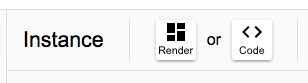
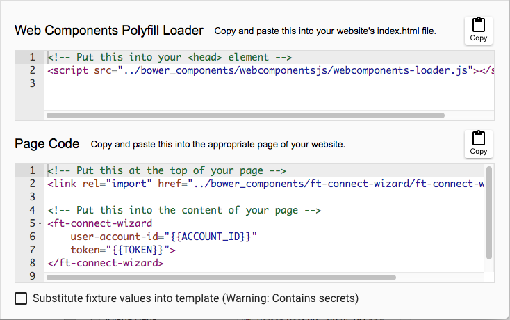
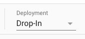
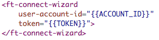
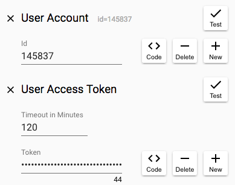

# Overview

In this section you'll take a look at the code generated by the FileThis development tool for your chosen web component variant and its configuration. This code can be used to easily bring an embedded instance of the component to life in your website.

## Viewing the code

In the _Instance_ panel of the development tool, click the "Code" button:

and observe that the main panel switches to show two subpanels with fragments of HTML code:

The first subpanel contains code that loads the Web Components "polyfill". This is JavaScript code that intelligently patches the user's runtime environment to add any functionality needed by the component that is not yet native in the version of the user's browser. The standard place to put code like this is into the _head_ element of your main index.html page so that it loads early and is available when it's needed.

The second subpanel contains the code that loads the FileThis component code and embeds it onto your chosen page. The first fragment in this subpanel is special kind of link element called an "HTML Import". This will load the referenced code and any HTML import links it contains, recursively, making sure that the same code is not loaded more than once (doing "deduplication"). You will put this link at the top of the page where you want to embed the component.

The second fragment in the second subpanel is the actual component element itself. You will put this at the appropriate spot in the content of your page.

## Deployment Type

In the _Instance_ panel of the development tool, observe that there is a popup menu named "Deployment" that lets you choose between "Drop-in" and "Production":

If you toggle this choice, you'll see that the URL's change in the links in the code subpanels below.

The "Drop-in" option make it very easy to test the FileThis web component because you don't need to provision your site to include the libraries that the component depends upon to run (including the code for the component's own implementation). Note that the URL's for this option are all external and are served from a CDN. Of course, you would not want to use this deployment option in your production system for several reasons. For one, you will want to run all client code through your build pipeline to vulcanize, minify, etc.

The "Production" option is what you'll want to use once you're done testing and prototyping. Note that the URL's in the production links refer to a "bower_components" directory that is relative to the page. You'll learn more in the next section about how to populate this directory.

## Configuration

Notice that, by default, the code fragment for instantiating the FileThis component has "handlebar" substitution parameters for two attributes:

To complete your integration with FileThis, you will need inject these values into your HTML by some means. Your back-end code will obtain the values them by making requests to our API. You don't need to deal with this just yet, but if you'd like to get an idea of what's required, you can click on the "Code" buttons in the "Fixture" panel of the development tool:

That will pose a modal dialog that lets you generate code for the server-side language and support library of your choice.

In the meantime, though, we will *cheat* and simply substitute the values that you already obtained in the development tool fixture. Do do this, click to select the checkbox at the bottom of the second code subpanel. Observe that the handlebar substitution parameters are replaced by your fixture's user account id and user access token. You'll copy this code in the next section to embed the component.

## The Next Steps

Now that you've been able to play with a live instance of a FileThis web component, and you have the code that's used to instantiate it, you're ready to try embedding your component code into an actual website.

If you're ambitious, and if it's easy, you might just try dropping the generated code above into your existing website on a dev server. It will render and function just as it should, talking to our production server. Of course it's not real, in the sense that you've cheated by using hard-coded access parameters (and the token will expire, furthermore), and you haven't done your back-end integration yet to do things like receive fetched documents, but it might be exciting to see things run on your site.

In the next section, you'll embed the component into a minimal website that is served from your development box.