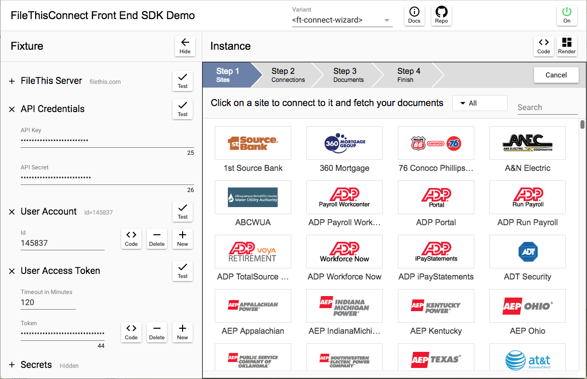

# FileThisConnect Demo

The _FileThisConnect Demo_ is a single-page application that embeds an instance of the FileThisConnect web component element. It's a fixture that wraps a UI around the component, letting you configure, control, and play with the instance. All you need to make it work are your FileThis partner account API key and API secret strings. You can obtain copies of these strings by copying them out of your FileThis partner admin console. If you do not have a FileThis partner account, please contact <oem@filethis.com>.

The purpose of the demo app is to let you get familiar with how the available variants of the web component appear and behave, and how they guide users through complete document fetching workflows, without yet looking "under the hood" to see how the web component element is wired up.

Once you've completed this section you'll be ready to learn how to embed the FileThisConnect web component into a very simple website that you serve from your development machine.

## Loading the App

Start by loading the demo app into your browser from [here](https://filethis.github.io/ft-connect-demo/).

Note that the values you enter into most of the fields in this app will be stored in the browser's local storage for your convenience. When you visit the page again, or refresh it, the fields will retain the values you entered previously. Fields which contain secrets are not stored with encryption. If you're not comfortable with leaving them there between sessions, you may click the "Clear" button at the bottom right of the configuration panel when you're done working.

## Fixture Configuration

1. If the configuration side-panel on the left of the window is not open, click the right-pointing arrow button at the upper left of the window to open it.
2. Copy and paste both your API key and API secret strings into the labeled fields.
3. Verify that they are valid by clicking the "Test" button to the right of the fields.
4. Create a FileThis user account for testing by clicking the "New" button to the right of the account ID field.
5. Observe that an account ID number appears in the field.
6. Test the validity of the account ID by clicking the "Test" button to the right of the field. You can do this at any point in the future as a sanity check.
7. Create a user access token for the account by clicking the "New" button to the right of the "Token" field.
8. Observe that a token string appears in the field.
9. Test the validity of the token by clicking the "Test" button to the right of the field. This is useful for testing whether your token has expired, or not before using it for additional testing.
10. Observe that there are two "variants" of the FileThisConnect web component available under the popup menu in the middle of the header bar of the main panel: _ft-connect-expand-out_ and _ft-connect-tabbed_. The former lets the user see a number of panels on the screen at the same time, expanding out to the right side of the web component element for each panel. The latter makes better use of screen real estate, placing each panel into a tab bar. You can choose the variant to use now, and you can change it later, even when the web component is active. Other variants will be available shortly.

## The Next Step

Now that you've been able to play with an instance of the FileThisConnect web component in an application served by our servers, you're ready for the next section in which you'll instantiate the component in a minimal website that is served from your development box.