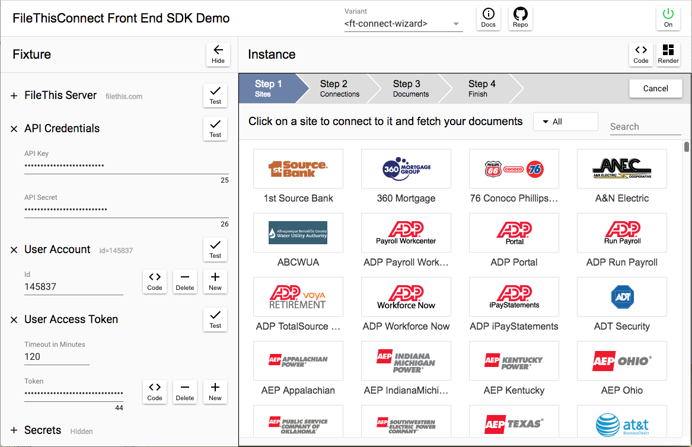
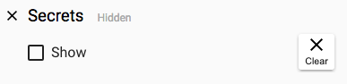

# Overview

The _FileThisConnect Front-End Development Tool_ is a single-page application that embeds an instance of the FileThisConnect web component element. It's a fixture that wraps a UI around the component, letting you configure, control, and play with the instance. All you need to make it work are your FileThis partner account API key and API secret strings. If you do not have a FileThis partner account yet, please contact <oem@filethis.com>.

In this section, you'll get familiar with how the available variants of the web component appear and behave, and how they guide users through complete document fetching workflows, without yet looking "under the hood" to see how the web component is wired up.

## Loading the App

Start by loading the demo app into your browser from [here](https://filethis.github.io/ft-connect-demo/).

Note that the values you enter into most of the fields in this app will be stored in the browser's local storage for your convenience. When you visit the page again, or refresh it, the fields will retain the values you entered previously. Fields which contain secrets are not stored with encryption. If you're not comfortable with leaving them there between sessions, you can click the "Clear" button in the "Secrets" item in the fixture panel when you're done working:

## Fixture Configuration

1. If the _Fixture_ side-panel on the left of the window is hidden, click the right-pointing arrow button at the upper left of the window to show it.
2. Copy and paste both your API key and API secret strings into the labeled fields.
3. Verify that they are valid by clicking the "Test" button to the right of the fields.
4. Create a FileThis user account for testing by clicking the "New" button to the right of the account ID field.
5. Observe that an account ID number appears in the field.
6. Test the validity of the account ID by clicking the "Test" button to the right of the field. You can do this at any point in the future as a sanity check.
7. Create a user access token for the account by clicking the "New" button to the right of the "Token" field.
8. Observe that a token string appears in the field.
9. Test the validity of the token by clicking the "Test" button to the right of the field. This is useful for testing whether your token has expired, or not before using it for additional testing.
10. Observe that there are three "variants" of the FileThisConnect web component available under the popup menu in the middle of the header bar of the main panel: _ft-connect-wizard_, _ft-connect-tabbed_, and _ft-connect-expand-out_. The last one lets the user see a number of panels on the screen at the same time, expanding out to the right side of the web component element for each panel. The second one makes better use of screen real estate, placing each panel into a tab bar. The first one embodies a complete, self-contained user workflow and is recommended as a starting point. Make sure that the _ft-connect-wizard_ is selected before proceeding.

## The Next Step

Having set up the fixture in the front end development tool, you're ready explore the behavior of a live instance of an embedded FileThis web component in the next section.
